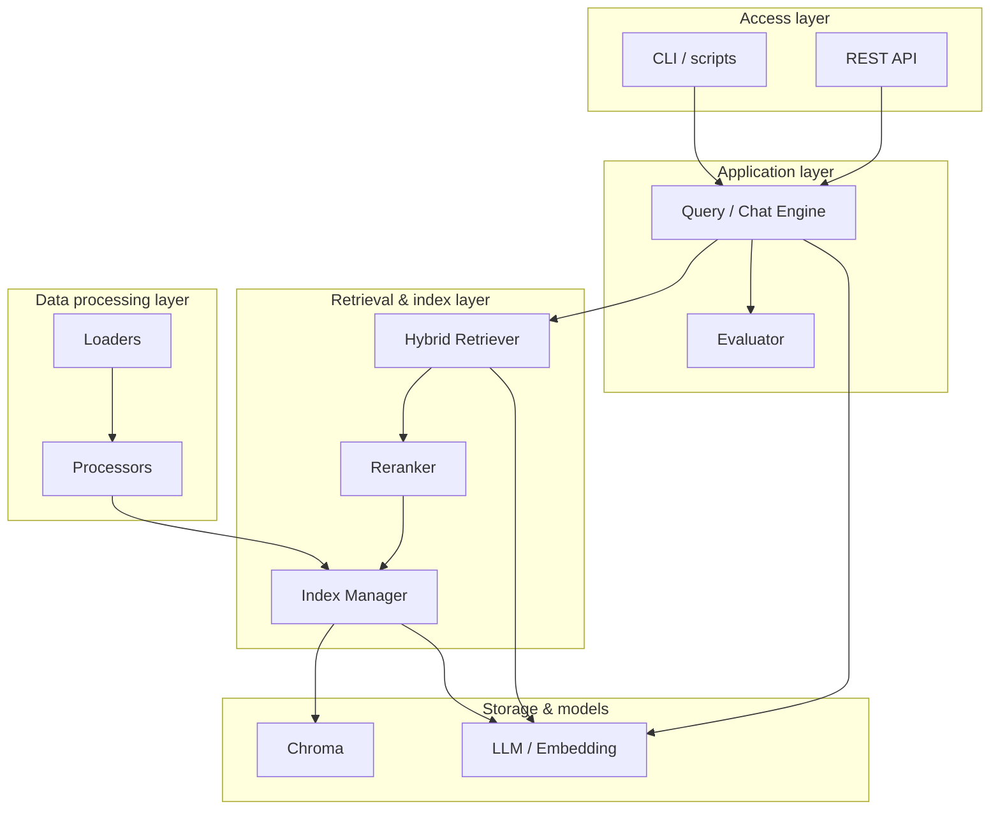
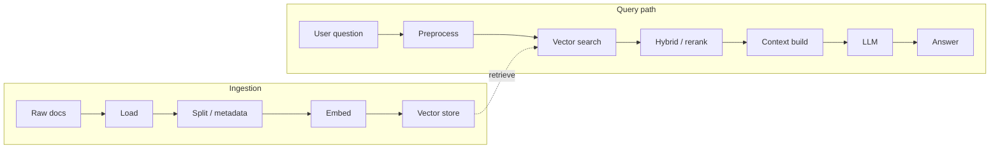
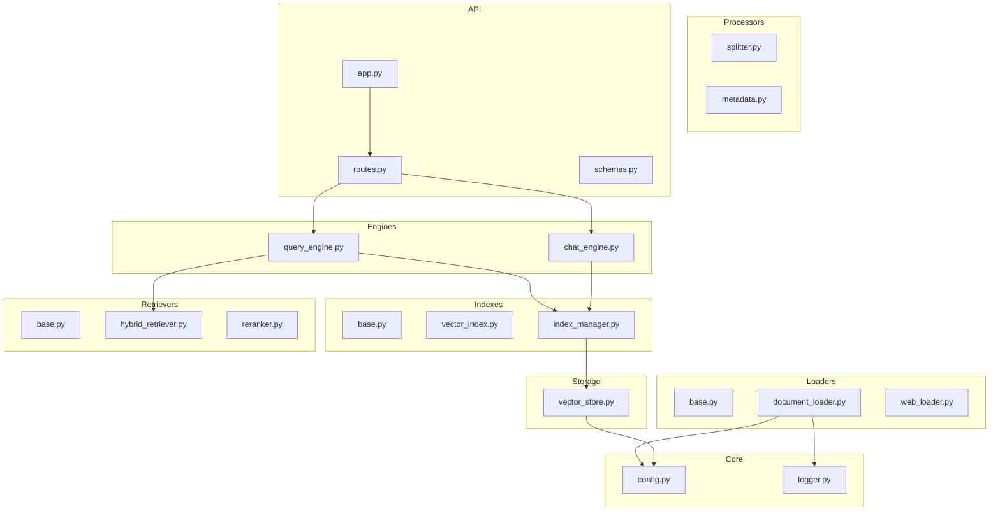
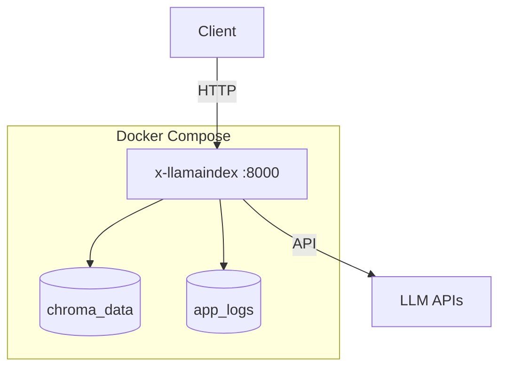
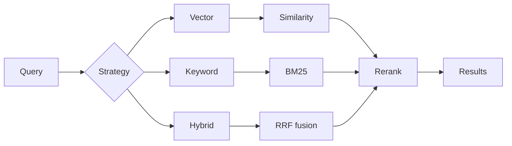

# x-llamaindex

## Introduction

**x-llamaindex** is a **production-oriented LlamaIndex and RAG reference** for Python developers. It walks through **document loading → chunking & metadata → vector indexing → hybrid retrieval & reranking → query/chat engines → FastAPI services**, with **clear layering, tests, and Docker deployment**, suitable for **structured learning** and as a **baseline for real RAG products**.

**Core value**: Reusable RAG building blocks (loaders, indexes, retrievers, engines, evaluation, API) that lower integration cost for LlamaIndex and vector stores, with a consistent story for **local vs. container** runs.

**When to use**: Knowledge-base Q&A, document assistants, prototypes through small-scale RAG deployments, or an internal LlamaIndex engineering template.

## Key Features

- **End-to-end RAG**: Multi-format ingestion, chunking, embeddings, Chroma-backed vector storage, index build, and querying.
- **Retrieval quality**: **Hybrid** (vector + BM25) retrieval and optional **reranking**.
- **API-first**: **FastAPI** REST API (health, query, chat, ingestion, etc.) with **Swagger, ReDoc, and OpenAPI** out of the box.
- **Configuration**: **`.env`** for secrets/runtime and **`config.yaml`** for service, logging, chunking, and retrieval knobs.
- **Operational basics**: **loguru** logging, Compose **health checks**, Docker **volumes** for vectors and logs.
- **Engineering hygiene**: **pytest** for loaders, processors, indexes, engines; **uv** + **`uv.lock`** for reproducible installs.

## Project Structure

Runtime may add `logs/`, `storage/chroma/`, etc.; see [.gitignore](.gitignore).

```
x-llamaindex/
├── src/                          # Source package
│   ├── core/                     # Settings (YAML + env), logging
│   ├── loaders/                  # File / web loaders
│   ├── processors/               # Splitting, metadata
│   ├── storage/                  # Chroma vector store wrapper
│   ├── indexes/                  # Indexes and IndexManager
│   ├── retrievers/               # Hybrid retrieval, reranker
│   ├── engines/                  # Query & chat engines
│   ├── evaluators/               # Evaluation helpers
│   ├── api/                      # FastAPI app, routes, schemas
│   └── utils/                    # Helpers and env bootstrap
├── examples/                     # basic / advanced / enterprise samples
├── tutorials/                    # Intro scripts
├── tests/                        # pytest
├── data/                         # Sample corpus
├── .gitee/                       # Gitee templates
├── pyproject.toml
├── uv.lock
├── .python-version
├── .env.example
├── config.yaml.example
├── Dockerfile
├── docker-compose.yml
├── docker-compose.prod.yml
├── .dockerignore
├── README.md / README.en.md
└── LICENSE
```

## System Architecture

### Layered architecture



### Core RAG flow



### Module dependency overview (optional)



## Quick Start

### Requirements

| Item | Windows | Linux |
|------|---------|--------|
| OS | Windows 10/11 (WSL2 or Git Bash recommended) | Recent mainstream distro |
| Python | **3.11+** (see [.python-version](.python-version)) | **3.11+** |
| Packages | **uv** | **uv** |
| Containers (optional) | **Docker Desktop** + Compose V2 | **Docker Engine** + **Compose plugin** |
| Network | Reachable LLM / embedding endpoints | Same |

### 1. Install uv

```bash
# Windows (PowerShell)
powershell -c "iwr https://astral.sh/uv/install.ps1 -useb | iex"

# Linux / macOS
curl -LsSf https://astral.sh/uv/install.sh | sh
```

### 2. Clone

```bash
git clone https://gitee.com/chain-engine/x-llamaindex.git
cd x-llamaindex
```

### 3. Install dependencies (uv)

```bash
uv sync
uv sync --all-extras
```

### 4. Configuration files

**(1) `.env`**

```bash
cp .env.example .env
```

Key groups (full list in [.env.example](.env.example)):

| Group | Examples | Purpose |
|-------|-----------|---------|
| LLM | `LLM_PROVIDER`, `DEEPSEEK_API_KEY`, `KIMI_API_KEY`, `GLM_API_KEY` | Provider + secrets |
| Models | `*_MODEL`, `*_API_BASE` | Model and base URL per vendor |
| Embedding | `EMBEDDING_PROVIDER`, `EMBEDDING_MODEL`, `EMBEDDING_DIMENSION` | Must match vector setup |
| Vector DB | `VECTOR_STORE_TYPE`, `CHROMA_PERSIST_DIR`, `CHROMA_COLLECTION_NAME` | Chroma paths / collection |
| Server | `HOST`, `PORT`, `DEBUG` | Bind address and debug |
| RAG | `CHUNK_SIZE`, `CHUNK_OVERLAP`, `SIMILARITY_TOP_K`, `SIMILARITY_THRESHOLD` | Chunking and retrieval |
| Logging | `LOG_LEVEL`, `LOG_FILE_PATH` | Verbosity and log file |

**(2) `config.yaml` (optional)**

```bash
cp config.yaml.example config.yaml
```

In `src/core/config.py`, precedence is **environment variables > `config.yaml` > defaults**. Typical sections: `server`, `logging`, `llm`, `embedding`, `vector_store`, `document`, `retrieval`, `agent`, `rag`, `evaluation` — see [config.yaml.example](config.yaml.example).

### 5. Run locally (API)

```bash
uv run python -m src.api.app

uv run uvicorn src.api.app:app --host 0.0.0.0 --port 8000 --reload
```

**Examples and tutorials**

```bash
uv run python examples/enterprise_rag.py
uv run python examples/basic_rag.py
uv run python examples/advanced_rag.py
uv run python tutorials/01_introduction.py
```

**Sample HTTP calls** (adjust host/port as needed)

```bash
curl http://localhost:8000/api/v1/health

curl -X POST http://localhost:8000/api/v1/query \
  -H "Content-Type: application/json" \
  -d '{"query": "What is LlamaIndex?", "top_k": 5}'

curl -X POST http://localhost:8000/api/v1/chat \
  -H "Content-Type: application/json" \
  -d '{"message": "Tell me about RAG systems"}'

curl -X POST http://localhost:8000/api/v1/documents \
  -H "Content-Type: application/json" \
  -d '{"texts": ["Document content here"]}'
```

### 6. Docker

**Default / dev**

```bash
cp .env.example .env
# edit .env — API keys, etc.

docker compose up -d --build
docker compose logs -f app
```

Open `http://localhost:8000` (or the host port you mapped via `PORT`).

**Production overlay**

```bash
docker compose -f docker-compose.yml -f docker-compose.prod.yml up -d --build
```

**Handy Compose commands**

```bash
docker compose ps
docker compose down
docker compose down -v
docker compose build --no-cache
docker compose exec app bash
```

**Persistence** ([docker-compose.yml](docker-compose.yml)): volumes **`chroma_data`** (vectors) and **`app_logs`** (logs); optional read-only `./data`, `./config.yaml`.



### 7. Common commands

| Task | Command |
|------|---------|
| All tests | `uv run pytest tests/ -v` |
| One file | `uv run pytest tests/test_loaders.py -v` |
| Coverage HTML | `uv run pytest tests/ --cov=src --cov-report=html` |
| Compile check | `uv run python -m compileall -q src` |

There is no Ruff/Black entry in `pyproject.toml`; add your formatter/linter locally if desired.

## Technology Stack

| Area | Choices |
|------|---------|
| Language | Python 3.11+ |
| Tooling | **uv**, [pyproject.toml](pyproject.toml) (hatchling) |
| RAG | **LlamaIndex**, OpenAI-compatible LLM/embed adapters |
| Vector DB | **ChromaDB** |
| Web | **FastAPI**, **Uvicorn**, Pydantic / pydantic-settings |
| Config & logs | PyYAML, python-dotenv, **loguru** |
| Testing | **pytest**, pytest-asyncio, httpx (dev) |
| Deploy | **Docker**, Docker Compose |

## API Documentation

With default `PORT` (usually **8000**):

| Kind | URL |
|------|-----|
| Swagger UI | [http://localhost:8000/docs](http://localhost:8000/docs) |
| ReDoc | [http://localhost:8000/redoc](http://localhost:8000/redoc) |
| OpenAPI JSON | [http://localhost:8000/openapi.json](http://localhost:8000/openapi.json) |

Replace `localhost:8000` with your deployment host and port.

## Storage

| Kind | Notes |
|------|--------|
| **Local / volume (vectors)** | **Chroma**: `CHROMA_PERSIST_DIR` (e.g. `./storage/chroma` locally, `/app/storage/chroma` in-container), `CHROMA_COLLECTION_NAME`. Compose binds named volume **`chroma_data`**. |
| **Object storage** | **Not integrated** (no S3/OSS/MinIO client in-repo). Extend loaders or your gateway if needed. |

## Core Modules

### 1. Document loaders (`loaders`)

| Format | Notes |
|--------|--------|
| TXT | Plain text |
| PDF | PDF files |
| DOCX | Word |
| MD | Markdown |
| JSON | JSON payloads |
| Web | Web pages |

```python
from src.loaders import DocumentLoader

loader = DocumentLoader()
documents = loader.load("./data")
```

### 2. Processors (`processors`)

```python
from src.processors import TextSplitter, ChunkingStrategy, MetadataExtractor

splitter = TextSplitter(
    strategy=ChunkingStrategy.SENTENCE,
    chunk_size=512,
    chunk_overlap=50,
)
nodes = splitter.split_documents(documents)

extractor = MetadataExtractor()
documents = extractor.enrich_documents(documents)
```

### 3. Vector store (`storage`)

```python
from src.storage import VectorStoreManager

vector_store = VectorStoreManager(
    persist_dir="./storage/chroma",
    collection_name="my_docs",
)
```

### 4. Indexes (`indexes`)

```python
from src.indexes import IndexManager, IndexType

index_manager = IndexManager(
    index_type=IndexType.VECTOR,
    vector_store_manager=vector_store,
)
index = index_manager.build_from_documents(documents)
```

### 5. Retrievers (`retrievers`)

```python
from src.retrievers import HybridRetriever, Reranker

retriever = HybridRetriever(
    index=index,
    vector_weight=0.7,
    keyword_weight=0.3,
)

reranker = Reranker(top_n=5)
reranked = reranker.rerank(query, nodes)
```

### 6. Engines (`engines`)

```python
from src.engines import RAGQueryEngine, RAGChatEngine

query_engine = RAGQueryEngine(
    index=index,
    use_hybrid_retrieval=True,
)
response = query_engine.query_with_sources("What is LlamaIndex?")

chat_engine = RAGChatEngine(index=index)
response = chat_engine.chat("Tell me about RAG systems")
```

### 7. Evaluators (`evaluators`)

```python
from src.evaluators import RAGEvaluator

evaluator = RAGEvaluator()
metrics = evaluator.evaluate_retrieval(query, retrieved_nodes)
```

### 8. API (`api`)

```python
from src.api import create_app

app = create_app()
# uv run uvicorn src.api.app:app --host 0.0.0.0 --port 8000
```

## What is LlamaIndex

**LlamaIndex** is a data framework for LLM apps, commonly used for **retrieval-augmented generation (RAG)** — it helps ingest, index, and query private data so models can answer with grounded context.

### LlamaIndex vs. LangChain

- **LlamaIndex**: Strong on **connectors, indexes, retrieval, and querying** for knowledge-heavy apps.
- **LangChain**: Strong on **chains and agents** for multi-step workflows.

They complement each other: LlamaIndex for data/retrieval, LangChain for orchestration.

### Index types (conceptual)

| Type | Role | Typical use |
|------|------|-------------|
| VectorStoreIndex | Dense vectors | Semantic search |
| SummaryIndex | Sequential scan | Full-corpus reasoning |
| TreeIndex | Hierarchical | Layered navigation |
| KeywordTableIndex | Lexical keys | Keyword lookup |

### Retrieval strategies (conceptual)



### Query response modes (conceptual)

| Mode | Meaning |
|------|---------|
| compact | Compress context |
| refine | Iterative improvement |
| tree_summarize | Tree-shaped summarization |
| simple | Straightforward prompt |

## Contributing

1. Fork the repo  
2. Create `Feat_xxx`  
3. Commit changes  
4. Open a Pull Request  

## License

MIT — see [LICENSE](LICENSE).

## References

- [LlamaIndex Docs](https://docs.llamaindex.ai/)
- [LlamaIndex GitHub](https://github.com/run-llama/llama_index)
- [RAG paper](https://arxiv.org/abs/2005.11401)
- [ChromaDB](https://docs.trychroma.com/)
- [FastAPI](https://fastapi.tiangolo.com/)
- [Python](https://docs.python.org/3/)
- [uv](https://docs.astral.sh/uv/)

## Contact

- **Author**: John Young  
- **Email**: [john.young@foxmail.com](mailto:john.young@foxmail.com)  
- **Gitee**: [https://gitee.com/yeyushilai](https://gitee.com/yeyushilai)  
- **GitHub**: [https://github.com/yeyushilai](https://github.com/yeyushilai)  
