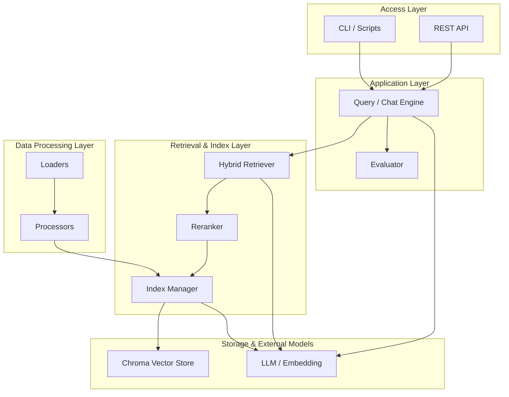
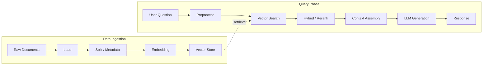
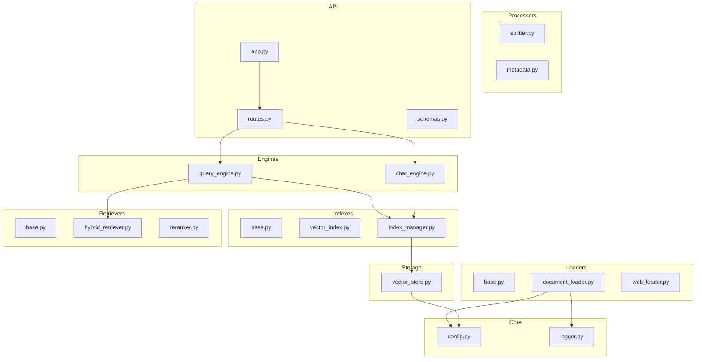
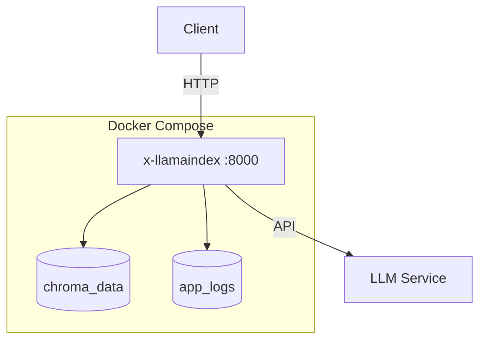

# x-llamaindex

[中文](README.md) | English

## Introduction

**x-llamaindex** is a production-grade LlamaIndex data orchestration learning and practice project. It delivers end-to-end RAG capabilities covering **document loading → chunking & metadata → vector indexing → hybrid retrieval & reranking → query/chat engines → FastAPI service layer**. With a clear layered architecture, comprehensive test coverage, and Docker deployment support, it is ideal for **structured RAG learning** and **rapidly building private knowledge-base Q&A prototypes**.

**Core Value**: Reusable RAG building blocks (loaders, indexes, retrievers, engines, evaluation, API) that lower the integration cost of LlamaIndex and vector stores, with a unified experience for local development and container deployment.

**Use Cases**: Knowledge-base Q&A, document assistants, RAG prototype validation through small-scale production deployments, or as an internal LlamaIndex engineering template.

## Quick Start

### 1. Requirements

| Item | Windows | Linux | macOS |
|------|---------|-------|-------|
| OS | Windows 10/11 (WSL2 or Git Bash recommended) | Recent mainstream distro (newer glibc) | macOS 12+ |
| Python | **3.11+** (see [.python-version](.python-version)) | **3.11+** | **3.11+** |
| Package Manager | **uv** (see install commands below) | **uv** | **uv** |
| Containers (optional) | **Docker Desktop** + Compose V2 | **Docker Engine** + **Compose plugin** | **Docker Desktop** + Compose V2 |
| Network | Accessible LLM / Embedding API endpoints | Same | Same |

### 2. Clone the Repository

```bash
git clone https://github.com/chain-engine/x-llamaindex.git
cd x-llamaindex
```

### 3. Install Dependencies

Using **uv** as the package manager (recommended); avoid pip unless necessary:

```bash
# Install uv (if not already installed)
# Windows (PowerShell)
powershell -c "iwr https://astral.sh/uv/install.ps1 -useb | iex"

# Linux / macOS
curl -LsSf https://astral.sh/uv/install.sh | sh

# Sync runtime dependencies
uv sync

# Sync with dev dependencies (pytest, etc.)
uv sync --all-extras
```

### 4. Configuration

**(1) Environment Variables `.env`**

```bash
cp .env.example .env
```

Key parameters (full list in [.env.example](.env.example)):

| Group | Examples | Purpose |
|-------|----------|---------|
| LLM | `LLM_PROVIDER`, `DEEPSEEK_API_KEY`, `KIMI_API_KEY`, `GLM_API_KEY` | Provider and API keys; switchable among deepseek / kimi / glm |
| Models | `*_MODEL`, `*_API_BASE` | Model names and base URLs per vendor |
| Embedding | `EMBEDDING_PROVIDER`, `EMBEDDING_MODEL`, `EMBEDDING_DIMENSION` | Must match vector dimension |
| Vector DB | `VECTOR_STORE_TYPE`, `CHROMA_PERSIST_DIR`, `CHROMA_COLLECTION_NAME` | Chroma local persistence paths |
| Server | `HOST`, `PORT`, `DEBUG` | API bind address and debug toggle |
| RAG | `CHUNK_SIZE`, `CHUNK_OVERLAP`, `SIMILARITY_TOP_K`, `SIMILARITY_THRESHOLD` | Chunking and retrieval parameters |
| Logging | `LOG_LEVEL`, `LOG_FILE_PATH` | Log level and file path |

**(2) YAML Configuration `config.yaml` (optional)**

```bash
cp config.yaml.example config.yaml
```

In `src/core/config.py`, precedence is **environment variables > `config.yaml` > built-in defaults**. Typical YAML sections: `server`, `logging`, `llm`, `embedding`, `vector_store`, `document`, `retrieval`, `agent`, `rag`, `evaluation` — see [config.yaml.example](config.yaml.example).

### 5. Start the Service

**Option A: Local development with hot reload (recommended)**

```bash
uv run uvicorn src.api.app:app --host 0.0.0.0 --port 8000 --reload
```

**Option B: Docker container deployment**

```bash
# Development / default mode
cp .env.example .env
# Edit .env with your API keys

docker compose up -d --build
docker compose logs -f app

# Production mode (with overlay config)
docker compose -f docker-compose.yml -f docker-compose.prod.yml up -d --build
```

Access at `http://localhost:8000` (port depends on your `PORT` setting).

**Other start methods**

```bash
# Run module directly
uv run python -m src.api.app
```

**Common Docker Commands**

| Command | Description |
|---------|-------------|
| `docker compose ps` | Show container status |
| `docker compose down` | Stop and remove containers |
| `docker compose down -v` | Stop and remove containers with volumes |
| `docker compose build --no-cache` | Rebuild without cache |
| `docker compose exec app bash` | Enter container shell |

### 6. Common Engineering Commands

| Purpose | Command |
|---------|---------|
| Run all tests | `uv run pytest tests/ -v` |
| Single test file | `uv run pytest tests/test_loaders.py -v` |
| Coverage report | `uv run pytest tests/ --cov=src --cov-report=html` |
| Compile check | `uv run python -m compileall -q src` |

> Ruff/Black are not configured in `pyproject.toml`. Install and run formatters/linters locally as needed.

### 7. Usage Examples

**Run example scripts**

```bash
# Basic RAG example
uv run python examples/basic_rag.py

# Advanced RAG example
uv run python examples/advanced_rag.py

# Enterprise RAG example
uv run python examples/enterprise_rag.py

# Introductory tutorial
uv run python tutorials/01_introduction.py
```

**API call examples** (after service starts)

```bash
# Health check
curl http://localhost:8000/api/v1/health

# RAG query
curl -X POST http://localhost:8000/api/v1/query \
  -H "Content-Type: application/json" \
  -d '{"query": "What is LlamaIndex?", "top_k": 5}'

# Multi-turn chat
curl -X POST http://localhost:8000/api/v1/chat \
  -H "Content-Type: application/json" \
  -d '{"message": "Tell me about RAG systems"}'

# Document ingestion
curl -X POST http://localhost:8000/api/v1/documents \
  -H "Content-Type: application/json" \
  -d '{"texts": ["Document content here"]}'
```

## Project Structure

```
x-llamaindex/
├── src/                          # Source code (Python package)
│   ├── api/                      # FastAPI app, routes, request/response schemas
│   │   ├── app.py                # FastAPI application entry
│   │   └── routes.py             # API route definitions
│   ├── core/                     # Config (YAML + env), logging, DI container
│   │   ├── config.py             # Config loading with priority management
│   │   ├── container.py          # Simple dependency injection container
│   │   └── logger.py             # loguru logger initialization
│   ├── loaders/                  # Document loaders (TXT/PDF/DOCX/MD/JSON/Web)
│   │   ├── base.py               # Loader base class
│   │   ├── document_loader.py    # Local document loading
│   │   └── web_loader.py         # Web page content loading
│   ├── processors/               # Text splitting, metadata extraction
│   │   ├── splitter.py           # Chunking strategies (sentence/paragraph/semantic)
│   │   └── metadata.py           # Metadata extraction and enrichment
│   ├── storage/                  # Chroma vector store wrapper
│   │   └── vector_store.py       # Vector store management
│   ├── indexes/                  # Index creation, management, and persistence
│   │   ├── base.py               # Index base class
│   │   ├── vector_index.py       # Vector index implementation
│   │   └── index_manager.py      # Index manager
│   ├── retrievers/               # Hybrid retrieval, reranking
│   │   ├── base.py               # Retriever base class
│   │   ├── hybrid_retriever.py   # Vector + BM25 hybrid retrieval
│   │   └── reranker.py           # Reranker
│   ├── engines/                  # Query engine, chat engine
│   │   ├── query_engine.py       # RAG query engine
│   │   └── chat_engine.py        # Multi-turn chat engine
│   ├── evaluators/               # RAG quality evaluation metrics
│   ├── schemas/                  # Data model definitions
│   ├── services/                 # Business service layer
│   ├── constants/                # Constants
│   ├── models/                   # Domain models
│   ├── repositories/             # Data access layer
│   ├── infras/                   # Infrastructure layer
│   ├── utils/                    # Helpers, environment bootstrap
│   └── main.py                   # Application entry
├── examples/                     # Basic / advanced / enterprise example scripts
├── tutorials/                    # Introductory tutorial scripts
├── tests/                        # pytest unit tests
├── data/                         # Sample corpus
├── .gitee/                       # Gitee Issue / PR templates
├── pyproject.toml                # Project and dependency declaration
├── uv.lock                       # Dependency lock file
├── .python-version               # Recommended Python version (3.11)
├── .env.example                  # Environment variable template
├── config.yaml.example           # YAML configuration template
├── Dockerfile                    # Multi-stage build image
├── docker-compose.yml            # Development / default compose
├── docker-compose.prod.yml       # Production overlay config
├── .dockerignore                 # Docker build ignore rules
├── README.md                     # Chinese documentation
├── README.en.md                  # English documentation
├── CHANGELOG.md                  # Version changelog
└── LICENSE                       # MIT License
```

## System Architecture

### Layered Architecture



### Core RAG Business Flow



### Module Dependency Graph



## Technology Stack

| Category | Technology |
|----------|------------|
| Language | Python 3.11+ |
| Package Management & Build | **uv**, pyproject.toml (hatchling) |
| RAG / Data Orchestration | **LlamaIndex**, OpenAI-compatible LLM/Embedding integration |
| Vector Database | **ChromaDB** (`llama-index-vector-stores-chroma`) |
| Web Framework | **FastAPI**, **Uvicorn**, Pydantic / pydantic-settings |
| Configuration | PyYAML, python-dotenv, pydantic-settings |
| Logging | **loguru** |
| Testing | **pytest**, pytest-asyncio, httpx |
| Deployment & Ops | **Docker**, Docker Compose |

## API Documentation

After the service starts (default port 8000), the following documentation is available:

| Type | URL |
|------|-----|
| Swagger UI (Interactive) | [http://localhost:8000/docs](http://localhost:8000/docs) |
| ReDoc (Read-only) | [http://localhost:8000/redoc](http://localhost:8000/redoc) |
| OpenAPI JSON Spec | [http://localhost:8000/openapi.json](http://localhost:8000/openapi.json) |

> When deployed to a different host or port, replace `localhost:8000` with the actual **host:port**.

**Core API Endpoints**

| Method | Path | Description |
|--------|------|-------------|
| `GET` | `/api/v1/health` | Health check |
| `POST` | `/api/v1/query` | RAG query (supports streaming) |
| `POST` | `/api/v1/chat` | Multi-turn chat |
| `POST` | `/api/v1/chat/stream` | Streaming chat |
| `POST` | `/api/v1/documents` | Document ingestion (upload to vector index) |
| `GET` | `/api/v1/index/status` | Index status query |
| `DELETE` | `/api/v1/chat/{session_id}` | Delete chat session |
| `GET` | `/api/v1/stats` | System statistics |

**Access Control**: The current version has no authentication mechanism, suitable for intranet or development environments. For production deployment, consider adding access control via Nginx gateway or API key middleware.

## Storage Configuration

| Storage Type | Description |
|-------------|-------------|
| **Local / Volume Persistence (Vectors)** | **Chroma** vector database: configure persistence path via `CHROMA_PERSIST_DIR` (default `./storage/chroma` locally, `/app/storage/chroma` in-container), collection name set by `CHROMA_COLLECTION_NAME`. Docker uses named volume **`chroma_data`**. |
| **Log Files** | Configure log file path via `LOG_FILE_PATH` (default `logs/rag_app.log`). Docker uses named volume **`app_logs`**. |
| **Object Storage** | S3/OSS/MinIO not integrated. Documents come from local directories and API uploads. Extend in the `loaders` layer if needed. |

**Docker Volume Persistence**



## License

This project is licensed under the [MIT](LICENSE) License.

## References

| Resource | Link |
|----------|------|
| Python Documentation | [https://docs.python.org/3/](https://docs.python.org/3/) |
| uv Documentation | [https://docs.astral.sh/uv/](https://docs.astral.sh/uv/) |
| LlamaIndex Documentation | [https://docs.llamaindex.ai/](https://docs.llamaindex.ai/) |
| LlamaIndex GitHub | [https://github.com/run-llama/llama_index](https://github.com/run-llama/llama_index) |
| ChromaDB Documentation | [https://docs.trychroma.com/](https://docs.trychroma.com/) |
| FastAPI Documentation | [https://fastapi.tiangolo.com/](https://fastapi.tiangolo.com/) |
| Docker Documentation | [https://docs.docker.com/](https://docs.docker.com/) |
| loguru Documentation | [https://loguru.readthedocs.io/](https://loguru.readthedocs.io/) |
| Pytest Documentation | [https://docs.pytest.org/](https://docs.pytest.org/) |
| RAG Paper | [https://arxiv.org/abs/2005.11401](https://arxiv.org/abs/2005.11401) |

## Contact

- **Author**: John Young
- **Email**: [john.young@foxmail.com](mailto:john.young@foxmail.com)
- **Gitee**: [https://gitee.com/yeyushilai](https://gitee.com/yeyushilai)
- **GitHub**: [https://github.com/yeyushilai](https://github.com/yeyushilai)
- **Project**: [https://github.com/chain-engine/x-llamaindex](https://github.com/chain-engine/x-llamaindex)
