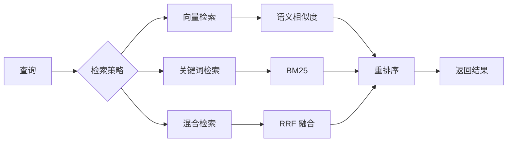
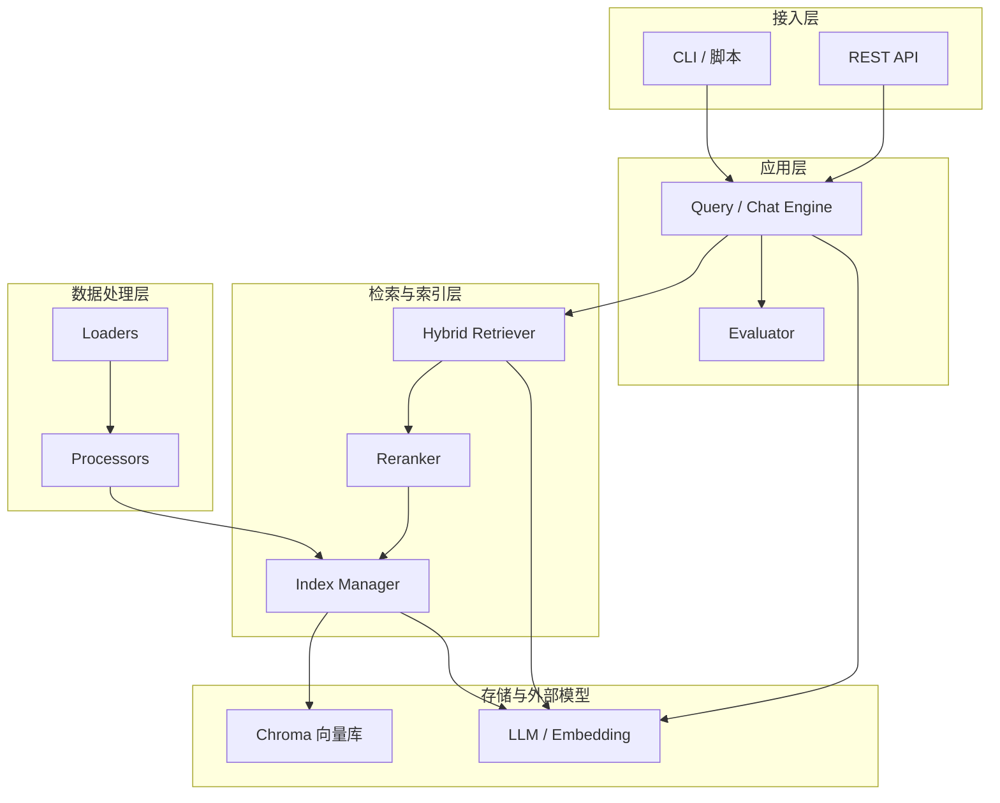
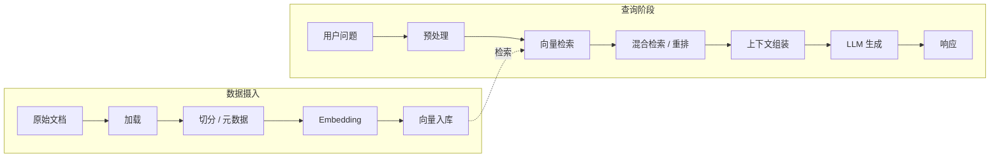
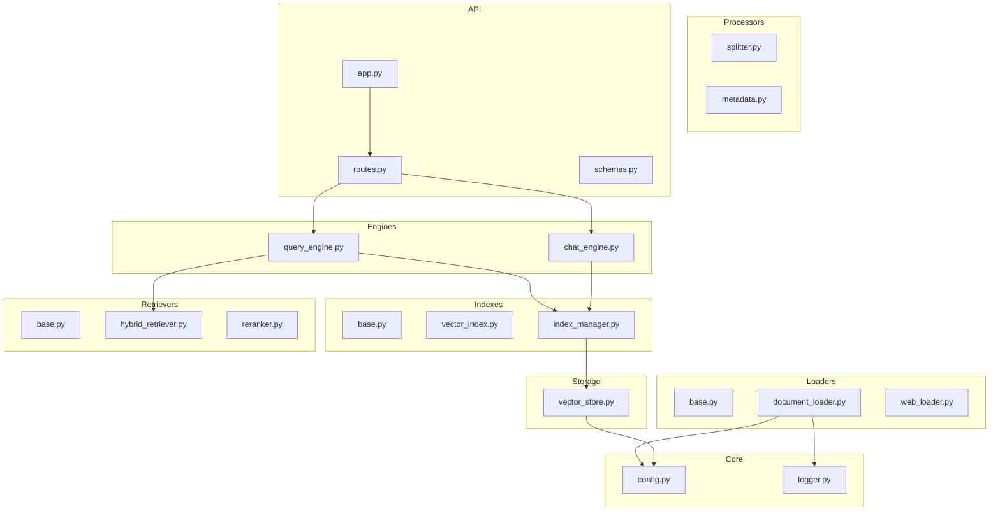
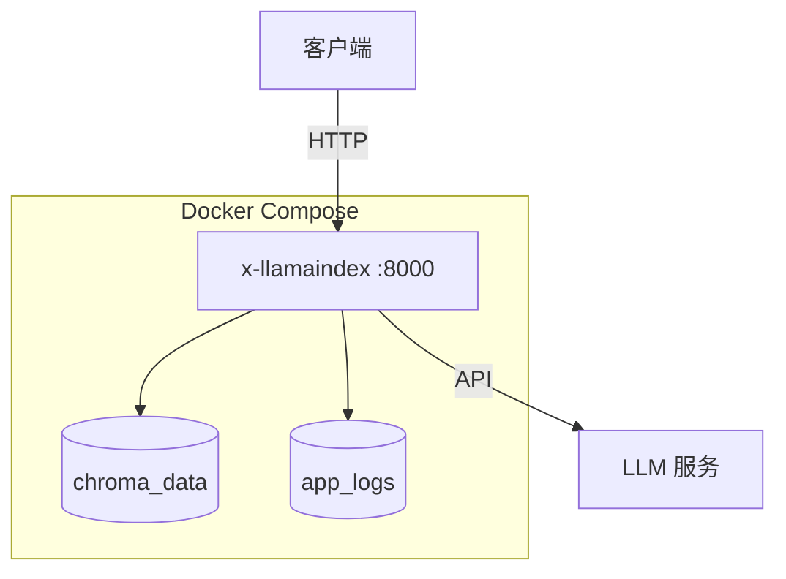

# x-llamaindex

## 项目简介

**x-llamaindex** 是一个生产级的 LlamaIndex（数据编排） 学习与实践项目。


## 什么是 LlamaIndex

**LlamaIndex** 是面向大语言模型应用的数据编排框架，常用于构建 **检索增强生成（RAG）**，提供处理、索引与查询外部数据的工具与抽象，以扩展 LLM 对私有知识的可用性。

### 与 LangChain 的关系

- **LlamaIndex**：侧重 **数据连接器、索引结构、检索与查询**，适合知识密集、检索路径复杂的应用。
- **LangChain**：侧重 **链路与 Agent 编排**，适合多步骤工具调用与工作流。

二者可组合：LlamaIndex 作数据与检索组件，LangChain 编排整体流程。

### 索引类型（概念）

| 索引类型 | 说明 | 适用场景 |
|---------|------|---------|
| VectorStoreIndex | 向量索引 | 语义相似检索 |
| SummaryIndex | 摘要索引 | 全文遍历 |
| TreeIndex | 树形索引 | 层次化检索 |
| KeywordTableIndex | 关键词索引 | 关键词匹配 |

### 检索策略（概念）



### 查询模式（概念）

| 模式 | 说明 |
|------|------|
| compact | 紧凑模式，压缩上下文 |
| refine | 精炼模式，逐步改进答案 |
| tree_summarize | 树状摘要 |
| simple | 简单模式 |


## 核心特征

- **端到端 RAG 流水线**：加载多格式文档、切分、Embedding、Chroma 向量存储、索引构建与查询。
- **检索增强**：向量 + BM25 **混合检索**、**重排序** 可选链路。
- **服务化**：**FastAPI** 提供 REST API（健康检查、查询、对话、文档摄入等），默认集成 **Swagger / ReDoc / OpenAPI**。
- **配置分层**：**.env**（密钥与运行参数）+ **config.yaml**（服务、日志、切分、检索等），与代码解耦。
- **可观测与可运维**：**loguru** 日志、Docker Compose **健康检查**、向量与日志 **卷持久化**。
- **质量内建**：**pytest** 覆盖加载、处理、索引、引擎等模块；**uv** 固定依赖（`uv.lock`）。


## 项目结构

```
x-llamaindex/
├── src/                          # 源代码（Python 包）
│   ├── core/                     # 配置（YAML + 环境变量）、日志
│   ├── loaders/                  # 文档 / 网页加载
│   ├── processors/               # 切分、元数据
│   ├── storage/                  # Chroma 向量存储封装
│   ├── indexes/                  # 索引与 IndexManager
│   ├── retrievers/               # 混合检索、重排
│   ├── engines/                  # 查询引擎、对话引擎
│   ├── evaluators/               # 评估指标
│   ├── api/                      # FastAPI 应用、路由、Schema
│   └── utils/                    # 辅助函数、环境初始化
├── examples/                     # basic / advanced / enterprise 示例
├── tutorials/                    # 入门教程脚本
├── tests/                        # pytest
├── data/                         # 示例语料
├── .gitee/                       # Gitee 模板（Issue / PR）
├── pyproject.toml                # 项目与依赖声明
├── uv.lock                       # 依赖锁定
├── .python-version               # 推荐 Python 版本
├── .env.example                  # 环境变量模板
├── config.yaml.example           # YAML 配置模板
├── Dockerfile                    # 应用镜像
├── docker-compose.yml            # 开发 / 默认编排
├── docker-compose.prod.yml       # 生产叠加配置
├── .dockerignore
├── README.md / README.en.md      # 中 / 英文说明
└── LICENSE                       # MIT
```

## 系统架构

### 系统分层架构图



### 核心功能业务流程图（RAG）



### 模块依赖关系图




## 模块说明

### 1. 文档加载器 (loaders)

支持多种数据格式的文档加载：

| 格式 | 说明 |
|------|------|
| TXT | 纯文本文件 |
| PDF | PDF 文档 |
| DOCX | Word 文档 |
| MD | Markdown 文件 |
| JSON | JSON 数据 |
| Web | 网页内容 |

```python
from src.loaders import DocumentLoader

loader = DocumentLoader()
documents = loader.load("./data")  # 加载目录下所有支持的文档
```

### 2. 文本处理器 (processors)

提供智能文本分割和元数据提取：

```python
from src.processors import TextSplitter, ChunkingStrategy, MetadataExtractor

# 文本分割
splitter = TextSplitter(
    strategy=ChunkingStrategy.SENTENCE,
    chunk_size=512,
    chunk_overlap=50
)
nodes = splitter.split_documents(documents)

# 元数据提取
extractor = MetadataExtractor()
documents = extractor.enrich_documents(documents)
```

### 3. 向量存储 (storage)

封装 ChromaDB 向量数据库：

```python
from src.storage import VectorStoreManager

vector_store = VectorStoreManager(
    persist_dir="./storage/chroma",
    collection_name="my_docs"
)
```

### 4. 索引管理 (indexes)

提供索引的创建、更新和持久化：

```python
from src.indexes import IndexManager, IndexType

index_manager = IndexManager(
    index_type=IndexType.VECTOR,
    vector_store_manager=vector_store
)
index = index_manager.build_from_documents(documents)
```

### 5. 检索器 (retrievers)

支持混合检索和重排序：

```python
from src.retrievers import HybridRetriever, Reranker

# 混合检索（向量 + BM25）
retriever = HybridRetriever(
    index=index,
    vector_weight=0.7,
    keyword_weight=0.3
)

# 重排序
reranker = Reranker(top_n=5)
reranked = reranker.rerank(query, nodes)
```

### 6. 查询引擎 (engines)

封装查询和对话功能：

```python
from src.engines import RAGQueryEngine, RAGChatEngine

# 查询引擎
query_engine = RAGQueryEngine(
    index=index,
    use_hybrid_retrieval=True
)
response = query_engine.query_with_sources("What is LlamaIndex?")

# 对话引擎
chat_engine = RAGChatEngine(index=index)
response = chat_engine.chat("Tell me about RAG systems")
```

### 7. 评估器 (evaluators)

提供 RAG 系统质量评估：

```python
from src.evaluators import RAGEvaluator

evaluator = RAGEvaluator()
metrics = evaluator.evaluate_retrieval(query, retrieved_nodes)
```

### 8. API 服务 (api)

提供 RESTful API 接口：

```python
from src.api import create_app

app = create_app()
# 启动: uv run uvicorn src.api.app:app --host 0.0.0.0 --port 8000
```


## 快速开始

### 环境要求

| 项 | Windows | Linux |
|----|---------|--------|
| 操作系统 | Windows 10/11（推荐 WSL2 或原生 Git Bash） | 主流发行版（glibc 较新） |
| Python | **3.11+**（与 [.python-version](.python-version) 一致） | **3.11+** |
| 包管理 | **uv**（见下） | **uv** |
| 容器（可选） | **Docker Desktop** + Compose V2 | **Docker Engine** + **Compose 插件** |
| 网络 | 需能访问所选 LLM / Embedding API | 同左 |

### 1. 安装 uv

```bash
# Windows（PowerShell）
powershell -c "iwr https://astral.sh/uv/install.ps1 -useb | iex"

# Linux / macOS
curl -LsSf https://astral.sh/uv/install.sh | sh
```

### 2. 克隆项目

```bash
git clone https://gitee.com/chain-engine/x-llamaindex.git
cd x-llamaindex
```

### 3. 安装依赖（uv 标准命令）

```bash
# 运行时依赖
uv sync

# 含开发依赖（pytest 等）
uv sync --all-extras
```

### 4. 配置文件创建

**（1）环境变量 `.env`**

```bash
cp .env.example .env
```

按需在 `.env` 中填写（主要项说明如下；完整列表见 [.env.example](.env.example)）。

| 分组 | 变量示例 | 说明 |
|------|-----------|------|
| LLM | `LLM_PROVIDER`、`DEEPSEEK_API_KEY`、`KIMI_API_KEY`、`GLM_API_KEY` | 提供方与密钥；可切换 deepseek / kimi / glm |
| 模型 | `*_MODEL`、`*_API_BASE` | 各厂商模型与 Base URL |
| Embedding | `EMBEDDING_PROVIDER`、`EMBEDDING_MODEL`、`EMBEDDING_DIMENSION` | 与向量维度一致 |
| 向量库 | `VECTOR_STORE_TYPE`、`CHROMA_PERSIST_DIR`、`CHROMA_COLLECTION_NAME` | 默认 Chroma 本地持久化路径 |
| 服务 | `HOST`、`PORT`、`DEBUG` | API 监听与调试开关 |
| RAG | `CHUNK_SIZE`、`CHUNK_OVERLAP`、`SIMILARITY_TOP_K`、`SIMILARITY_THRESHOLD` | 切分与召回参数 |
| 日志 | `LOG_LEVEL`、`LOG_FILE_PATH` | 级别与文件路径 |

**（2）YAML 配置 `config.yaml`（可选）**

```bash
cp config.yaml.example config.yaml
```

`src/core/config.py` 中优先级为 **环境变量 > `config.yaml` > 内置默认值**。YAML 典型块：`server`、`logging`、`llm`、`embedding`、`vector_store`、`document`、`retrieval`、`agent`、`rag`、`evaluation` 等（详见 [config.yaml.example](config.yaml.example)）。

### 5. 本地启动 API

```bash
# 方式一
uv run python -m src.api.app

# 方式二（热重载开发）
uv run uvicorn src.api.app:app --host 0.0.0.0 --port 8000 --reload
```

**使用示例与脚本**

```bash
# 企业级 / 基础 / 高级示例
uv run python examples/enterprise_rag.py
uv run python examples/basic_rag.py
uv run python examples/advanced_rag.py

# 入门教程
uv run python tutorials/01_introduction.py
```

**API 调用示例**（服务启动后，将 `localhost:8000` 换为你的地址）

```bash
curl http://localhost:8000/api/v1/health

curl -X POST http://localhost:8000/api/v1/query \
  -H "Content-Type: application/json" \
  -d '{"query": "What is LlamaIndex?", "top_k": 5}'

curl -X POST http://localhost:8000/api/v1/chat \
  -H "Content-Type: application/json" \
  -d '{"message": "Tell me about RAG systems"}'

curl -X POST http://localhost:8000/api/v1/documents \
  -H "Content-Type: application/json" \
  -d '{"texts": ["Document content here"]}'
```

### 6. Docker 启动

**开发 / 默认**

```bash
cp .env.example .env
# 编辑 .env，填入 API Key 等

docker compose up -d --build
docker compose logs -f app
```

访问：`http://localhost:8000`（若本机 `PORT` 映射有变，以 Compose 端口为准）。

**生产（叠加配置文件）**

```bash
docker compose -f docker-compose.yml -f docker-compose.prod.yml up -d --build
```

**常用 Compose 命令**

```bash
docker compose ps
docker compose down
docker compose down -v
docker compose build --no-cache
docker compose exec app bash
```

**容器持久化**（见 [docker-compose.yml](docker-compose.yml)）：卷 `chroma_data`（向量）、`app_logs`（日志）；可选只读挂载 `./data`、`./config.yaml`。



### 7. 常用命令

| 用途 | 命令 |
|------|------|
| 运行全部测试 | `uv run pytest tests/ -v` |
| 单个测试文件 | `uv run pytest tests/test_loaders.py -v` |
| 覆盖率 HTML | `uv run pytest tests/ --cov=src --cov-report=html` |
| 语法编译检查 | `uv run python -m compileall -q src` |

说明：当前仓库未在 `pyproject.toml` 中配置 Ruff/Black；格式化可在本机按需安装工具后执行。

## 技术栈

| 类别 | 技术 |
|------|------|
| 语言与运行时 | Python 3.11+ |
| 包管理与构建 | **uv**、[pyproject.toml](pyproject.toml)（hatchling） |
| RAG / 编排 | **LlamaIndex**、OpenAI 兼容 LLM/Embedding 集成 |
| 向量库 | **ChromaDB**（`llama-index-vector-stores-chroma`） |
| Web 框架 | **FastAPI**、**Uvicorn**、Pydantic / pydantic-settings |
| 配置与日志 | PyYAML、python-dotenv、**loguru** |
| 测试 | **pytest**、pytest-asyncio、httpx（dev） |
| 部署 | **Docker**、Docker Compose |

## API 文档

**服务默认监听 `PORT`（一般为 8000）时：**

| 类型 | 地址 |
|------|------|
| Swagger UI（可调试） | [http://localhost:8000/docs](http://localhost:8000/docs) |
| ReDoc（只读） | [http://localhost:8000/redoc](http://localhost:8000/redoc) |
| OpenAPI JSON | [http://localhost:8000/openapi.json](http://localhost:8000/openapi.json) |

部署到其它主机或端口时，将 `localhost:8000` 替换为实际 **主机:端口**。

## 存储配置

| 类型 | 说明 |
|------|------|
| **本地 / 卷持久化（向量）** | **Chroma**：环境变量 `CHROMA_PERSIST_DIR`（本地默认如 `./storage/chroma`；容器内为 `/app/storage/chroma`），集合名 `CHROMA_COLLECTION_NAME`。Docker 使用命名卷 **`chroma_data`** 挂到向量目录。 |
| **对象存储** | 本仓库 **未集成** S3/OSS/MinIO 等对象存储；文档源主要来自本地目录、上传接口文本等。若需对象存储，可在 `loaders` 或网关层自行扩展。 |


## 许可证

本项目采用 MIT 许可证，详见根目录 [LICENSE](LICENSE)。

## 参考资料

- [LlamaIndex 官方文档](https://docs.llamaindex.ai/)
- [LlamaIndex GitHub](https://github.com/run-llama/llama_index)
- [RAG 论文（arXiv）](https://arxiv.org/abs/2005.11401)
- [ChromaDB 文档](https://docs.trychroma.com/)
- [FastAPI 文档](https://fastapi.tiangolo.com/)
- [Python 文档](https://docs.python.org/3/)
- [uv 文档](https://docs.astral.sh/uv/)

## 联系方式

- **作者**：John Young  
- **邮箱**：[john.young@foxmail.com](mailto:john.young@foxmail.com)  
- **Gitee**：[https://gitee.com/yeyushilai](https://gitee.com/yeyushilai)  
- **GitHub**：[https://github.com/yeyushilai](https://github.com/yeyushilai)  
