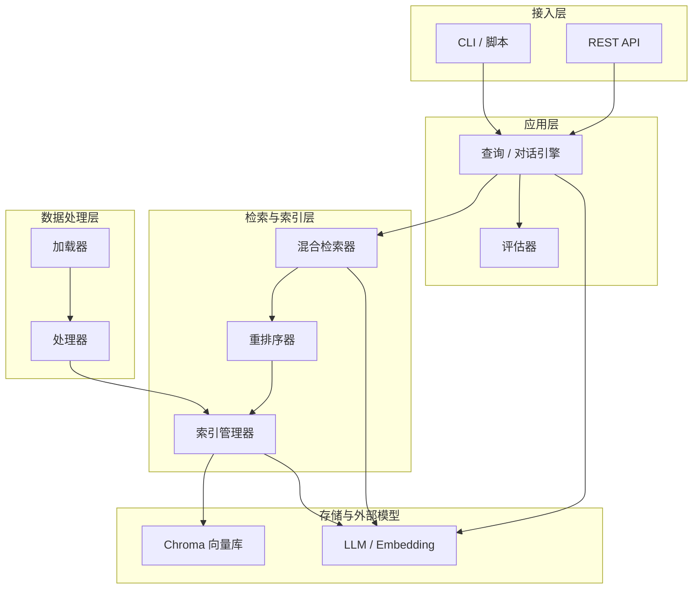
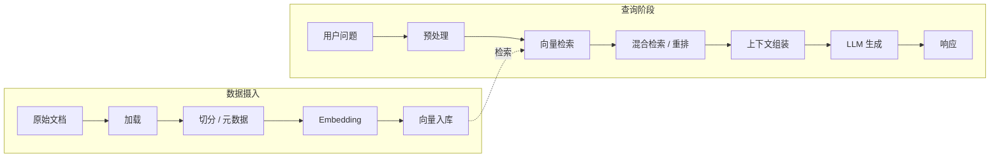
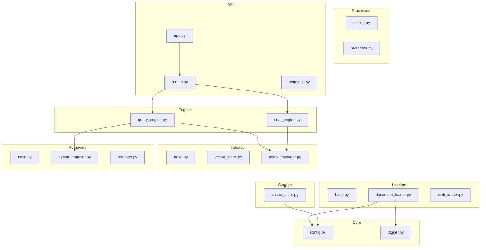
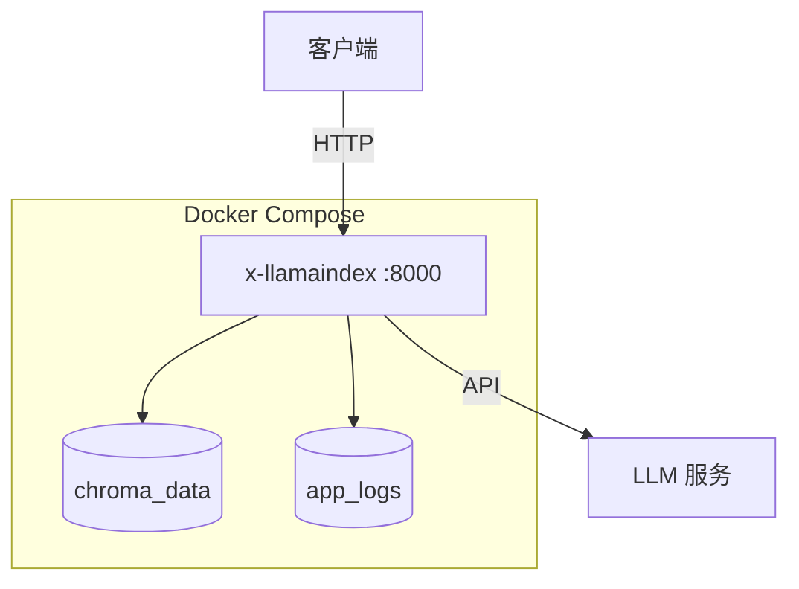

# x-llamaindex

[English](README.en.md) | 中文

## 项目简介

**x-llamaindex** 是一个生产级的 LlamaIndex 数据编排学习与实践项目，提供从 **文档加载 → 切分与元数据 → 向量索引 → 混合检索与重排序 → 查询/对话引擎 → FastAPI 服务化** 的端到端 RAG 能力。项目具备清晰的分层架构、完善的测试覆盖与 Docker 部署方案，适用于 **结构化学习 RAG 技术栈** 与 **快速搭建私有知识库问答原型**。

**核心价值**：可复用的 RAG 构件（加载器、索引、检索器、引擎、评估、API），降低 LlamaIndex 与向量存储的集成成本，统一本地开发与容器部署体验。

**适用场景**：知识库问答、文档助手、RAG 原型验证至小规模生产部署，或作为团队内部 LlamaIndex 工程模板。

## 快速开始

### 1. 环境要求

| 项 | Windows | Linux | macOS |
|----|---------|-------|-------|
| 操作系统 | Windows 10/11（推荐 WSL2 或原生 Git Bash） | 主流发行版（glibc 较新） | macOS 12+ |
| Python | **3.11+**（与 [.python-version](.python-version) 一致） | **3.11+** | **3.11+** |
| 包管理 | **uv**（见下方安装命令） | **uv** | **uv** |
| 容器（可选） | **Docker Desktop** + Compose V2 | **Docker Engine** + **Compose 插件** | **Docker Desktop** + Compose V2 |
| 网络 | 需能访问所选 LLM / Embedding API | 同左 | 同左 |

### 2. 项目代码克隆

```bash
git clone https://github.com/chain-engine/x-llamaindex.git
cd x-llamaindex
```

### 3. 依赖同步安装

使用 **uv** 作为包管理工具（推荐），非必要不使用 pip：

```bash
# 安装 uv（如尚未安装）
# Windows (PowerShell)
powershell -c "iwr https://astral.sh/uv/install.ps1 -useb | iex"

# Linux / macOS
curl -LsSf https://astral.sh/uv/install.sh | sh

# 同步运行时依赖
uv sync

# 同步含开发依赖（pytest 等）
uv sync --all-extras
```

### 4. 环境配置

**（1）环境变量 `.env`**

```bash
cp .env.example .env
```

核心参数说明（完整列表见 [.env.example](.env.example)）：

| 分组 | 变量示例 | 说明 |
|------|-----------|------|
| LLM | `LLM_PROVIDER`、`DEEPSEEK_API_KEY`、`KIMI_API_KEY`、`GLM_API_KEY` | 提供方与密钥；可切换 deepseek / kimi / glm |
| 模型 | `*_MODEL`、`*_API_BASE` | 各厂商模型与 Base URL |
| Embedding | `EMBEDDING_PROVIDER`、`EMBEDDING_MODEL`、`EMBEDDING_DIMENSION` | 嵌入模型需与向量维度一致 |
| 向量库 | `VECTOR_STORE_TYPE`、`CHROMA_PERSIST_DIR`、`CHROMA_COLLECTION_NAME` | 默认 Chroma 本地持久化路径 |
| 服务 | `HOST`、`PORT`、`DEBUG` | API 监听地址与调试开关 |
| RAG | `CHUNK_SIZE`、`CHUNK_OVERLAP`、`SIMILARITY_TOP_K`、`SIMILARITY_THRESHOLD` | 切分与召回参数 |
| 日志 | `LOG_LEVEL`、`LOG_FILE_PATH` | 日志级别与文件路径 |

**（2）YAML 配置 `config.yaml`（可选）**

```bash
cp config.yaml.example config.yaml
```

`src/core/config.py` 中配置优先级为 **环境变量 > `config.yaml` > 内置默认值**。YAML 典型配置块：`server`、`logging`、`llm`、`embedding`、`vector_store`、`document`、`retrieval`、`agent`、`rag`、`evaluation` 等（详见 [config.yaml.example](config.yaml.example)）。

### 5. 服务启动

**方式一：本地开发热重载启动（推荐）**

```bash
uv run uvicorn src.api.app:app --host 0.0.0.0 --port 8000 --reload
```

**方式二：Docker 容器部署**

```bash
# 开发 / 默认模式
cp .env.example .env
# 编辑 .env，填入 API Key 等

docker compose up -d --build
docker compose logs -f app

# 生产模式（叠加配置）
docker compose -f docker-compose.yml -f docker-compose.prod.yml up -d --build
```

访问 `http://localhost:8000`（端口以实际 `PORT` 配置为准）。

**其他启动方式**

```bash
# 直接运行模块
uv run python -m src.api.app
```

**Docker 常用命令**

| 命令 | 说明 |
|------|------|
| `docker compose ps` | 查看容器状态 |
| `docker compose down` | 停止并移除容器 |
| `docker compose down -v` | 停止并移除容器及数据卷 |
| `docker compose build --no-cache` | 无缓存重新构建 |
| `docker compose exec app bash` | 进入容器 Shell |

### 6. 常用工程命令

| 用途 | 命令 |
|------|------|
| 运行全部测试 | `uv run pytest tests/ -v` |
| 单个测试文件 | `uv run pytest tests/test_loaders.py -v` |
| 测试覆盖率报告 | `uv run pytest tests/ --cov=src --cov-report=html` |
| 语法编译检查 | `uv run python -m compileall -q src` |

> 当前仓库未在 `pyproject.toml` 中配置 Ruff/Black；格式化与静态检查可按需在本机安装工具后执行。

### 7. 使用方法示例

**运行示例脚本**

```bash
# 基础 RAG 示例
uv run python examples/basic_rag.py

# 高级 RAG 示例
uv run python examples/advanced_rag.py

# 企业级 RAG 示例
uv run python examples/enterprise_rag.py

# 入门教程
uv run python tutorials/01_introduction.py
```

**API 调用示例**（服务启动后）

```bash
# 健康检查
curl http://localhost:8000/api/v1/health

# RAG 查询
curl -X POST http://localhost:8000/api/v1/query \
  -H "Content-Type: application/json" \
  -d '{"query": "什么是 LlamaIndex？", "top_k": 5}'

# 多轮对话
curl -X POST http://localhost:8000/api/v1/chat \
  -H "Content-Type: application/json" \
  -d '{"message": "介绍一下 RAG 系统"}'

# 文档摄入
curl -X POST http://localhost:8000/api/v1/documents \
  -H "Content-Type: application/json" \
  -d '{"texts": ["文档内容"]}'
```

## 项目结构

```
x-llamaindex/
├── src/                          # 源代码（Python 包）
│   ├── api/                      # FastAPI 应用、路由、请求/响应 Schema
│   │   ├── app.py                # FastAPI 应用入口
│   │   └── routes.py             # API 路由定义
│   ├── core/                     # 配置（YAML + 环境变量）、日志、依赖容器
│   │   ├── config.py             # 配置加载与优先级管理
│   │   ├── container.py          # 简易依赖注入容器
│   │   └── logger.py             # loguru 日志初始化
│   ├── loaders/                  # 文档加载器（TXT/PDF/DOCX/MD/JSON/网页）
│   │   ├── base.py               # 加载器基类
│   │   ├── document_loader.py    # 本地文档加载
│   │   └── web_loader.py         # 网页内容加载
│   ├── processors/               # 文本切分、元数据提取
│   │   ├── splitter.py           # 切分策略（句子/段落/语义）
│   │   └── metadata.py           # 元数据提取与丰富
│   ├── storage/                  # Chroma 向量存储封装
│   │   └── vector_store.py       # 向量库管理
│   ├── indexes/                  # 索引创建、管理与持久化
│   │   ├── base.py               # 索引基类
│   │   ├── vector_index.py       # 向量索引实现
│   │   └── index_manager.py      # 索引管理器
│   ├── retrievers/               # 混合检索、重排序
│   │   ├── base.py               # 检索器基类
│   │   ├── hybrid_retriever.py   # 向量 + BM25 混合检索
│   │   └── reranker.py           # 重排序器
│   ├── engines/                  # 查询引擎、对话引擎
│   │   ├── query_engine.py       # RAG 查询引擎
│   │   └── chat_engine.py        # 多轮对话引擎
│   ├── evaluators/               # RAG 质量评估指标
│   ├── schemas/                  # 数据模型定义
│   ├── services/                 # 业务服务层
│   ├── constants/                # 常量定义
│   ├── models/                   # 领域模型
│   ├── repositories/             # 数据访问层
│   ├── infras/                   # 基础设施层
│   ├── utils/                    # 辅助函数、环境初始化
│   └── main.py                   # 应用启动入口
├── examples/                     # 基础 / 高级 / 企业级示例脚本
├── tutorials/                    # 入门教程脚本
├── tests/                        # pytest 单元测试
├── data/                         # 示例语料
├── .gitee/                       # Gitee Issue / PR 模板
├── pyproject.toml                # 项目与依赖声明
├── uv.lock                       # 依赖锁定文件
├── .python-version               # 推荐 Python 版本（3.11）
├── .env.example                  # 环境变量模板
├── config.yaml.example           # YAML 配置模板
├── Dockerfile                    # 多阶段构建镜像
├── docker-compose.yml            # 开发 / 默认编排
├── docker-compose.prod.yml       # 生产叠加配置
├── .dockerignore                 # Docker 构建忽略规则
├── README.md                     # 中文说明文档
├── README.en.md                  # 英文说明文档
├── CHANGELOG.md                  # 版本变更记录
└── LICENSE                       # MIT 开源协议
```

## 系统架构

### 系统分层架构图



### 核心业务流程图（RAG）



### 模块依赖关系图



## 技术栈

| 类别 | 技术 |
|------|------|
| 开发语言 | Python 3.11+ |
| 包管理与构建 | **uv**、pyproject.toml（hatchling） |
| RAG / 数据编排 | **LlamaIndex**、OpenAI 兼容 LLM / Embedding 集成 |
| 向量数据库 | **ChromaDB**（`llama-index-vector-stores-chroma`） |
| Web 框架 | **FastAPI**、**Uvicorn**、Pydantic / pydantic-settings |
| 配置管理 | PyYAML、python-dotenv、pydantic-settings |
| 日志 | **loguru** |
| 测试 | **pytest**、pytest-asyncio、httpx |
| 部署运维 | **Docker**、Docker Compose |

## API 文档说明

服务启动后（默认端口 8000），可访问以下文档：

| 类型 | 地址 |
|------|------|
| Swagger UI（交互式调试） | [http://localhost:8000/docs](http://localhost:8000/docs) |
| ReDoc（只读文档） | [http://localhost:8000/redoc](http://localhost:8000/redoc) |
| OpenAPI JSON 规范 | [http://localhost:8000/openapi.json](http://localhost:8000/openapi.json) |

> 部署到其它主机或端口时，将 `localhost:8000` 替换为实际 **主机:端口**。

**核心 API 接口清单**

| 方法 | 路径 | 说明 |
|------|------|------|
| `GET` | `/api/v1/health` | 健康检查 |
| `POST` | `/api/v1/query` | RAG 查询（支持流式响应） |
| `POST` | `/api/v1/chat` | 多轮对话 |
| `POST` | `/api/v1/chat/stream` | 流式对话 |
| `POST` | `/api/v1/documents` | 文档摄入（上传至向量索引） |
| `GET` | `/api/v1/index/status` | 索引状态查询 |
| `DELETE` | `/api/v1/chat/{session_id}` | 删除对话会话 |
| `GET` | `/api/v1/stats` | 系统统计信息 |

**权限控制**：当前版本 API 无鉴权机制，适合内网或开发环境使用。生产部署建议通过 Nginx 网关或 API Key 中间件增加访问控制。

## 存储配置说明

| 存储类型 | 说明 |
|---------|------|
| **本地文件 / 卷持久化（向量）** | **Chroma** 向量数据库：通过 `CHROMA_PERSIST_DIR` 配置持久化路径（本地默认 `./storage/chroma`，容器内 `/app/storage/chroma`），集合名由 `CHROMA_COLLECTION_NAME` 指定。Docker 使用命名卷 **`chroma_data`** 挂载。 |
| **日志文件** | 通过 `LOG_FILE_PATH` 配置日志文件路径（默认 `logs/rag_app.log`）。Docker 使用命名卷 **`app_logs`** 持久化。 |
| **对象存储** | 当前未集成 S3/OSS/MinIO 等对象存储；文档源主要来自本地目录与 API 上传。如需扩展，可在 `loaders` 层自行接入。 |

**Docker 卷持久化示意**



## 许可证

本项目采用 [MIT](LICENSE) 开源许可证。

## 参考资料

| 资源 | 链接 |
|------|------|
| Python 官方文档 | [https://docs.python.org/3/](https://docs.python.org/3/) |
| uv 官方文档 | [https://docs.astral.sh/uv/](https://docs.astral.sh/uv/) |
| LlamaIndex 官方文档 | [https://docs.llamaindex.ai/](https://docs.llamaindex.ai/) |
| LlamaIndex GitHub | [https://github.com/run-llama/llama_index](https://github.com/run-llama/llama_index) |
| ChromaDB 文档 | [https://docs.trychroma.com/](https://docs.trychroma.com/) |
| FastAPI 文档 | [https://fastapi.tiangolo.com/](https://fastapi.tiangolo.com/) |
| Docker 官方文档 | [https://docs.docker.com/](https://docs.docker.com/) |
| loguru 文档 | [https://loguru.readthedocs.io/](https://loguru.readthedocs.io/) |
| Pytest 文档 | [https://docs.pytest.org/](https://docs.pytest.org/) |
| RAG 论文 | [https://arxiv.org/abs/2005.11401](https://arxiv.org/abs/2005.11401) |

## 联系方式

- **作者**：John Young（夜雨诗来）
- **邮箱**：[john.young@foxmail.com](mailto:john.young@foxmail.com)
- **Gitee**：[https://gitee.com/yeyushilai](https://gitee.com/yeyushilai)
- **GitHub**：[https://github.com/yeyushilai](https://github.com/yeyushilai)
- **项目地址**：[https://github.com/chain-engine/x-llamaindex](https://github.com/chain-engine/x-llamaindex)
